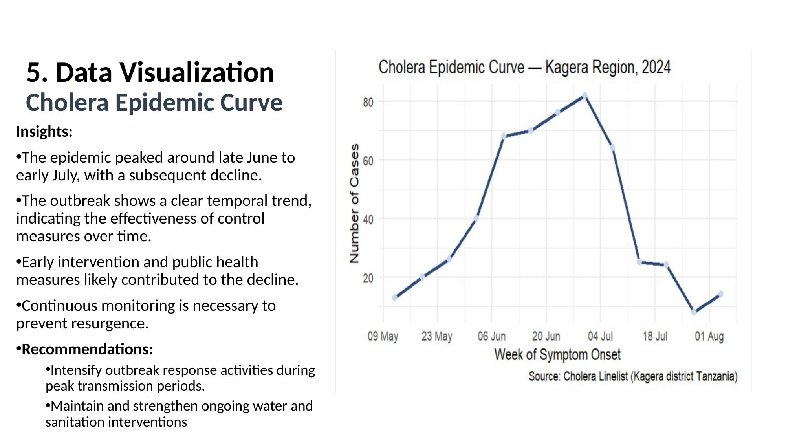
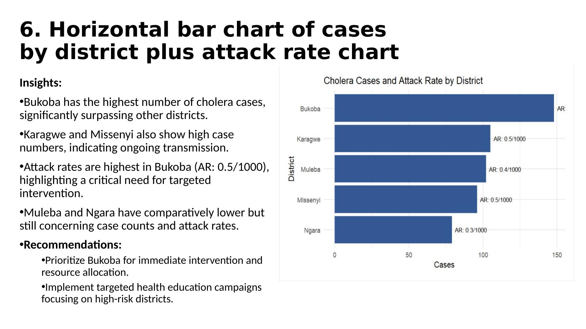
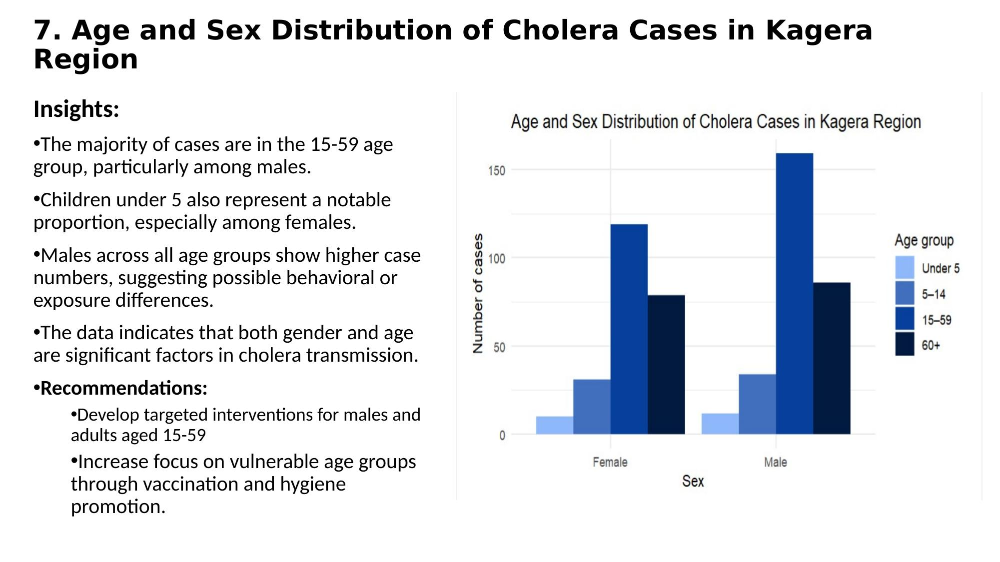
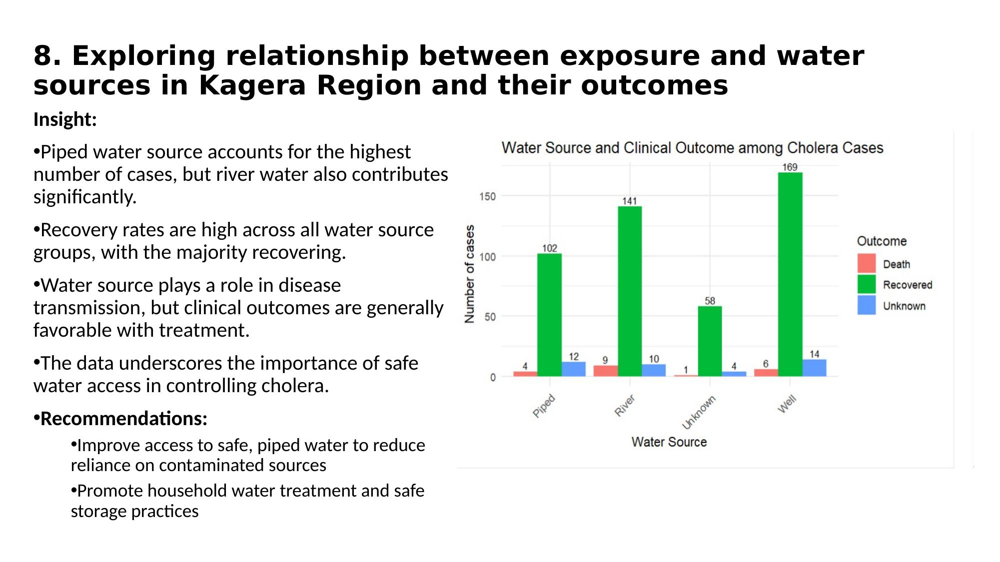
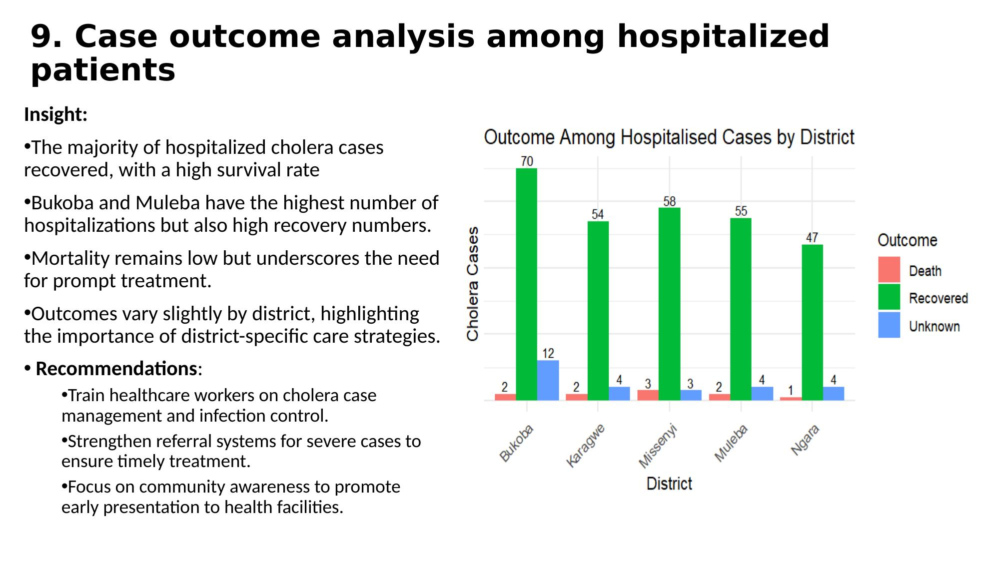

# 🦠 Cholera Outbreak in Kagera, 2024
### Epidemiological Analysis of Distribution and Burden

**Tools:** R · Quarto · ggplot2 · dplyr · lubridate  
**Author:** Tiwa Daodu  
**Domain:** Epidemiology · Public Health · Outbreak Analysis  
**Data:** Cholera Linelist — Kagera Region, Tanzania (542 records)

---

## 📌 Project Overview

This project conducts a full epidemiological analysis of a **cholera outbreak in the Kagera Region of northwestern Tanzania** using R. Starting from a raw, messy linelist dataset, the analysis covers data cleaning, descriptive statistics, burden metrics, and data visualisation following real-world outbreak investigation methodology.

**Core Questions Answered:**
- How many cases and deaths occurred, and what is the Case Fatality Rate?
- Which districts bear the highest burden?
- Who is most affected by age and sex?
- What water sources are linked to transmission?
- Is the outbreak increasing or declining over time?

---

## 🧹 Data Cleaning

The raw dataset contained 542 records with duplicates, inconsistent formatting, and missing values. The following steps were applied in R:

| Issue | Fix Applied |
|-------|-------------|
| 5 duplicate records | Removed → 542 clean records retained |
| 17 missing age values | Filtered out |
| Inconsistent sex labels (m, M, male) | Standardised to Male / Female / Unknown |
| Date stored as string | Converted to `Date` type using `lubridate` |
| No epi week column | Created using `floor_date()` |

---

## 📊 Key Metrics

| Metric | Value |
|--------|-------|
| Total Cases | 530 |
| Deaths | 20 |
| Recovered | 470 |
| Case Fatality Rate (CFR) | 3.8% |
| Overall Attack Rate | 0.0039 per 1,000 population |

A CFR of 3.8% indicates a **moderately severe outbreak** — approximately 4 deaths per 100 infections — possibly reflecting delayed treatment or limited healthcare access in some districts.

---

## 📈 Visualisations

### Chart 1 — Cholera Epidemic Curve


**Key Findings:**
- Outbreak onset from mid-May 2024, peaking in **late June to early July**
- Clear decline after the peak, suggesting effective control measures
- Continuous monitoring remains necessary to prevent resurgence

---

### Chart 2 — Cases and Attack Rate by District


**Key Findings:**
- **Bukoba** recorded the highest cases (148) and highest attack rate (AR: 0.5/1000)
- **Karagwe** has fewer cases but the highest CFR (~6.7%), suggesting severe outcomes
- **Ngara** has the lowest cases (79) and lowest CFR (~1.3%), indicating better outcomes
- Variation in CFR across districts points to differences in healthcare access and reporting

---

### Chart 3 — Age and Sex Distribution


**Key Findings:**
- The **15–59 age group** has the highest number of cases, particularly among males
- Children under 5 represent a notable proportion, especially among females
- Males show higher case counts across all age groups, suggesting behavioural or exposure differences

---

### Chart 4 — Water Source and Clinical Outcomes


**Key Findings:**
- **Well water** users have the highest number of cases (169 recovered)
- **River water** users show the highest CFR (~5.6%), linked to more severe outcomes
- Recovery rates are high across all water source groups with treatment
- Safe water access is the single most important factor in controlling transmission

---

### Chart 5 — Outcomes Among Hospitalised Patients by District


**Key Findings:**
- The majority of hospitalised patients recovered across all districts
- **Bukoba and Muleba** have the highest hospitalisations but also the highest recovery numbers
- Mortality remains low overall, underlining the importance of prompt hospital admission
- District-specific variation in outcomes calls for tailored care strategies

---

## 💡 Recommendations

**Public Health Interventions:**
1. **Prioritise Bukoba** for immediate resource allocation — highest cases and attack rate
2. **Investigate Karagwe's high CFR** (6.7%) — possible delays in care or reporting gaps
3. **Target well and river water users** with household water treatment education and safe storage campaigns
4. **Develop gender and age-targeted interventions** for males aged 15–59, the most affected group

**Clinical & Systems Strengthening:**
5. **Train healthcare workers** on cholera case management and infection control protocols
6. **Strengthen referral systems** to ensure severe cases reach facilities in time
7. **Intensify response during peak transmission windows** (June–July) based on the epidemic curve

---

## 📂 Repository Structure

```
├── FP_quarto_doc.qmd                  # Full R analysis script (Quarto document)
├── kagera_cholera_linelist.csv        # Raw dataset — 542 patient records
├── Kagera_Tiwa_Daodu.pptx             # Full presentation of findings
├── Chart_1_Epidemic_Curve.jpg
├── Chart_2_Cases_by_District.jpg
├── Chart_3_Age_Sex_Distribution.jpg
├── Chart_4_Water_Source_Outcomes.jpg
├── Chart_5_Hospitalised_Outcomes.jpg
└── README.md
```

---

## 🔍 How to Reproduce This Analysis

1. Clone or download this repository
2. Open `FP_quarto_doc.qmd` in **RStudio**
3. Ensure the following R packages are installed:
```r
install.packages(c("readr", "dplyr", "lubridate", "ggplot2"))
```
4. Make sure `kagera_cholera_linelist.csv` is in the **same folder** as the `.qmd` file
5. Click **Render** in RStudio to generate the full HTML report

---

## 👤 About the Author

**Tiwa Daodu** — HealthCare Data Analyst  
📧 *daodutiwaloluwa@gmail.com*  
🔗 *linkedin.com/in/tiwaloluwadaodu31*  
🌍 Lagos, Nigeria
